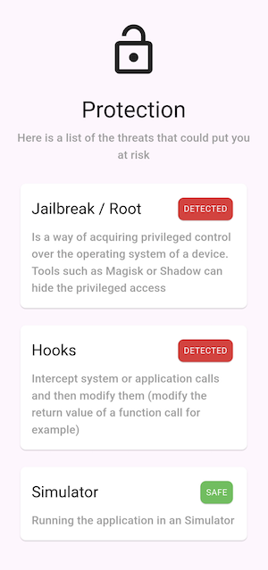

# Mobile Security Toolkit


[](https://pub.dev/packages/flutter_security_toolkit)

|             | Android | iOS   |
|-------------|---------|-------|
| **Support** | SDK 28+ | 13.0+ |



In a world where mobile devices hold vast amounts of personal and
business-critical data, security is no longer optional — it's essential.

Security Suite is an open-source project designed to work on mobile security by
providing a developer-friendly, all-in-one repository for developers and
security experts.

This project uses:

- [iOS Security Toolkit](https://github.com/EXXETA/iOS-Security-Toolkit) 
- [Android Security Toolkit](https://github.com/EXXETA/Android-Security-Toolkit) 

## Features

Already implemented Features are:
- [x] Jailbreak or Root Detection
- [x] Hooks Detection
- [x] Simulator Detection

You can see them in action with the [Example App](./example) we've provided

## Installation

You can use the Mobile Security Toolkit in your project by importing it with
Swift Package Manager

### pub.dev
Add the following to your `pubspec.yaml`:

```
dependencies:
  flutter_security_toolkit: ^1.0.1
```

## Usage

### Variable API

Use the gettable variables to get current status of the device:

- `Future<bool?> areRootPrivilegesDetected()`
- `Future<bool?> areHooksDetected()`
- `Future<bool?> isSimulatorDetected()`
- `Future<bool?> isDebuggerDetected()`

### Async Stream API

This feature will soon be implemented

## Roadmap

Next features to be implemented:
- [ ] App Signature Check
- [ ] Debugger Detection
- [ ] Device Passcode Check
- [ ] Integrity Check
- [ ] Hardware Security Check

## Contributing

See [CONTRIBUTING](./CONTRIBUTING.md)

## Authors and acknowledgment

Authors:
- [Yessine Choura](https://github.com/ychoura)
- [Denis Dobanda](https://github.com/theDeniZ)

Special Thanks:
- Sabrina Geiger
- Dennis Gill
- Jonas Rottmann

## License

See [LICENSE](./LICENSE)
